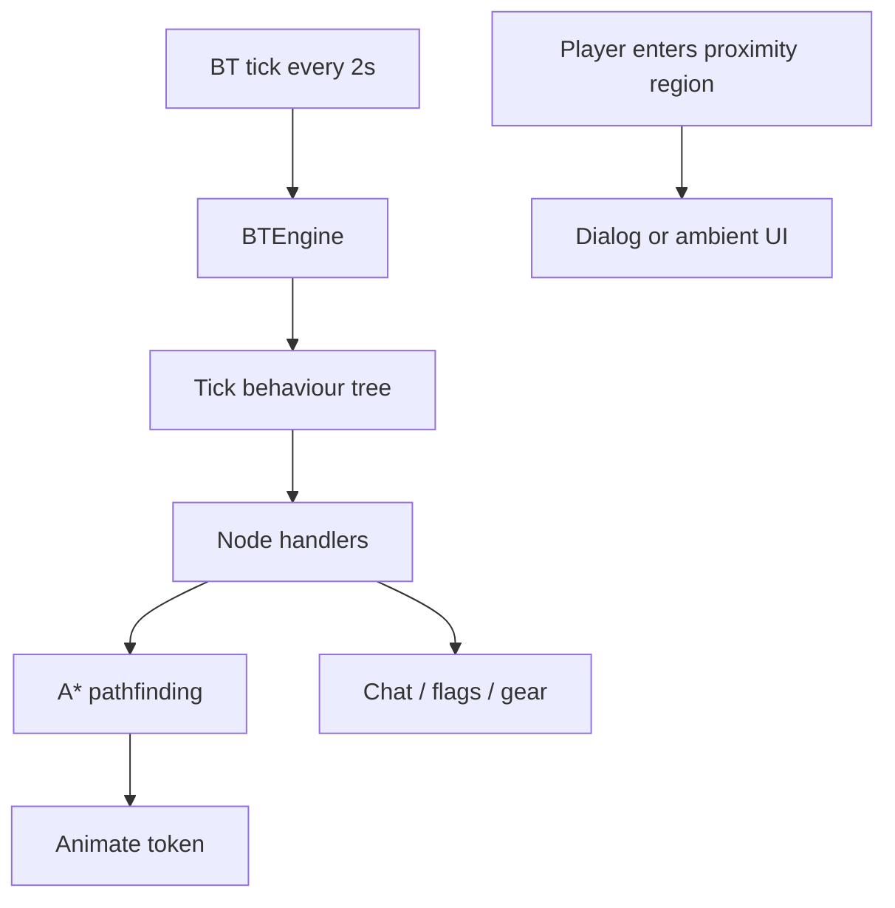

# dc-npc-patrols

Behaviour-tree-driven NPC AI for Deadlands Classic — A* navigation around walls, scene-region targets, branching dialog trees, ambient flavour lines, and boon-based quest consequences.

## Requirements

- **Foundry VTT** v14+
- **Deadlands-Classic** system

## Setup

1. Place this module in `modules/dc-npc-patrols/`
2. Enable the module in Foundry (Game Settings → Manage Modules)
3. Configure settings (Game Settings → Configure Settings → NPC Patrols & Dialog)
4. Open the **NPC Patrol Hub** from the Scene Controls bar (route icon)

## Quick Start

1. **Create a behaviour tree** — NPC Patrol Hub → World Content → Behaviour Trees → New Tree. Build logic using composite/condition/action nodes (see [Node Reference](#node-reference) below).
2. **Define scene regions** — In Foundry, draw named regions on the scene for NPCs to navigate to (`action_move_to_region`) or check (`condition_in_region`).
3. **Assign the tree to an NPC** — Hub → select NPC → Behaviour → pick a tree. Set per-NPC template variables (e.g. region names) if the tree uses `{{var}}` placeholders.
4. **Attach dialog/ambient (optional)** — Under Interactions, attach dialog trees or ambient line sets. Proximity regions are created automatically.
5. **Set scene weather (optional)** — Hub → Scene view → weather dropdown, if your tree uses `condition_weather`.

## Features

| Feature | Description |
|---------|-------------|
| **NPC Patrol Hub** | Unified GM window for scene controls, world content editors (behaviour trees, dialog trees, ambient sets), and per-NPC behaviour/interaction config. |
| **Behaviour tree engine** | Ticks every 2 seconds on the GM client. Each NPC with an assigned tree gets a blackboard (runtime state) and returns SUCCESS, FAILURE, or RUNNING from each node. |
| **A* pathfinding** | Wall-aware navigation with configurable sub-grid resolution. Supports multi-level scenes via Change Level regions. Used by `action_move_to` and `action_move_to_region`. |
| **Path debug overlay** | Visualise the last computed path on the canvas. Toggle in the hub (Scene view) or press **Alt+Shift+P**. |
| **Dialog trees** | World-level branching conversations. When a player enters a proximity region, a conversation panel opens with NPC text and response buttons. Responses can set quest flags and fire boons through the DC boon pipeline. |
| **Ambient line sets** | Random flavour lines whispered to a player when they enter an NPC's proximity region (with per-player cooldown). |
| **Region behaviors** | `dcDialogTree` and `dcAmbient` Foundry region behavior types — attached automatically when you link dialog/ambient content to an NPC. |
| **Fragments** | Reusable behaviour-tree subtrees. Save a branch as a fragment and insert it into other trees from the BT editor. |
| **Template variables** | BT fields can use `{{var}}` placeholders. Each tree declares variables (text, number, boolean, `region_select`, `foundry_id`); per-NPC values are stored on the actor and resolved at tick time. |



## Module Settings

| Setting | Default | Description |
|---------|---------|-------------|
| Enable NPC Patrols | `true` | Master toggle for all NPC behaviour. |
| Movement Speed | `600` | Token animation speed (pixels per second). |
| Stagger Delay | `80` | Milliseconds between sequential NPC movements. |
| Default Proximity Radius | `2` | Grid squares for auto-generated dialog/ambient regions. |
| Ambient Dialog Cooldown | `30` | Seconds before an NPC repeats ambient dialog to the same player. |
| Freeze Patrols in Combat | `true` | NPCs with combat behaviour `freeze` stop moving during combat. |
| Pathfinding Resolution | `4` | Subdivides each grid square into N×N nav cells. `1` = coarse, `4` = recommended for tight corridors. |

**Hub-only controls** (not in module settings):

- **Pause / Resume BT** — pauses behaviour-tree ticks world-wide
- **Scene weather** — affects `condition_weather` nodes
- **Path debug toggle** — show/hide last computed path overlay

## Behaviour Tree Concepts

### Node categories

| Category | Role |
|----------|------|
| **Composite** | Controls flow — runs child nodes (`sequence`, `selector`, `parallel`). |
| **Decorator** | Wraps a single child and modifies its result (`inverter`, `cooldown`). |
| **Condition** | Leaf check — returns SUCCESS or FAILURE instantly, never RUNNING. |
| **Action** | Leaf behaviour — may return RUNNING while work is in progress. |

### Return statuses

| Status | Meaning |
|--------|---------|
| `success` | Node completed successfully. |
| `failure` | Node failed; parent composite decides what happens next. |
| `running` | Node is still working; the tree resumes this node on the next tick. |

Multi-tick actions (`action_move_to`, `action_move_to_region`, `action_wait`) return RUNNING until finished.

### Stateful composites

`sequence`, `selector`, and `parallel` remember which child was running and resume from there on the next tick instead of restarting from the beginning. This is essential for A* movement that spans many ticks.

`parallel` ticks all children each pass. Completed children are not re-ticked. Succeeds when `required` children succeed (defaults to all). Fails if too many children fail.

### Blackboard

Per-NPC runtime state updated each tick:

- **Time** — `current_unixtime`, `current_minutes`, `weekday`, `day_changed`
- **World** — `combat_active`, `weather`
- **Token** — `token`, `actor`, `scene`, `moving`, `level_id`, `elevation`, `sleep_state`
- **Custom** — e.g. `visible_tokens` (written by vision nodes), `target` / `{key}_range` (written by targeting nodes)

### Placeholders

**Chat placeholders** (in `action_chat` text):

| Placeholder | Value |
|-------------|-------|
| `{name}` | Token or actor name |
| `{actor_name}` | Actor name |
| `{time}` | Current campaign time (HH:MM) |
| `{weekday}` | Day name |

**Template variables** (in any BT field):

- `{{variable_key}}` — resolved from the tree's variable definitions and the actor's per-NPC overrides (`bt_variables` flag).
- Variable types: `text`, `number`, `boolean`, `region_select` (dropdown of scene region names), `foundry_id` (dropdown of scene door wall IDs).

### Scene regions

Foundry scene regions are the primary spatial targets. Create named regions on the scene, then reference them in BT nodes or bind them via `region_select` template variables so each NPC can share one tree with different destinations.

---

## Node Reference

### Composites

| Node ID | Label | Description |
|---------|-------|-------------|
| `sequence` | Sequence (AND) | Runs children left to right. Fails on first failure. Resumes from the running child on the next tick. |
| `selector` | Selector (OR) | Tries children left to right. Succeeds on first success. Resumes from the running child on the next tick. |
| `parallel` | Parallel | Runs all children simultaneously. Succeeds when N succeed (`required`, default = all). Skips children that already completed. |

### Decorators

| Node ID | Label | Description | Key fields |
|---------|-------|-------------|------------|
| `inverter` | Inverter (NOT) | Inverts child result: success → failure, failure → success. Running stays running. | — |
| `cooldown` | Cooldown | Prevents child re-execution for N seconds after a success. Returns failure while on cooldown. | `seconds` (default 60) |

### Conditions

All conditions return instantly — never RUNNING.

| Node ID | Label | Description | Key fields |
|---------|-------|-------------|------------|
| `condition_flag` | Condition: Flag | Checks an actor flag with a comparison operator. | `scope`, `flag_path`, `flag_key`, `operator`, `expected_value` |
| `condition_time` | Condition: Time | True if current campaign time is within the window. Supports overnight ranges (e.g. 22:00–06:00). | `start_time`, `end_time` |
| `condition_combat` | Condition: Combat | True if a combat encounter is active. | — |
| `condition_weather` | Condition: Weather | True if scene weather matches (or does not match) the configured value. | `weather` (clear/rain/snow/storm/fog), `match` |
| `condition_day` | Condition: Day | True if today is one of the listed weekdays. Empty list = always true. | `days` (0=Sun … 6=Sat, comma-separated) |
| `condition_in_region` | Condition: In Region | True if the NPC token is inside the named scene region. | `region_name` |
| `condition_visible_tokens` | Condition: Visible Tokens | True if enough tokens on the blackboard match the filter. Optionally refreshes the list first. | `blackboard_key`, `min_count`, `filter`, `name_contains`, `refresh`, `max_range`, `include_self`, `exclude_hidden` |
| `condition_range` | Condition: Range | True if distance to a blackboard target matches the threshold. Computes on the fly if not pre-measured. | `target_key`, `operator`, `value`, `measure_mode` |
| `condition_variable` | Condition: Variable | True if a tree template variable on this NPC matches (e.g. `is_believer`). | `variable_key`, `operator`, `expected_value` |

**Flag operators** (`condition_flag`, `condition_range`, `condition_variable`): `exists`, `not_exists`, `equals`, `not_equals`, `greater`, `less`, `greater_eq`, `less_eq`, `contains`, `starts_with`.

**Vision filters** (`condition_visible_tokens`, `action_update_visible_tokens`): `all`, `players`, `npcs`.

### Actions

Actions may return RUNNING while work is in progress.

| Node ID | Label | Description | Key fields |
|---------|-------|-------------|------------|
| `action_move_to` | Action: Move To | A* pathfind to a grid coordinate. Returns RUNNING while stepping through the path. Handles Change Level stairs automatically. | `dest_x`, `dest_y`, `dest_elevation` (or `waypoint_label` if set) |
| `action_move_to_region` | Action: Move To Region | A* pathfind to the nearest accessible cell inside a named region. Fires arrival events on completion. Already inside the region → immediate success. | `region_name` |
| `action_door_interact` | Action: Door Interact | A* path to a door wall and set its state (open, closed, or locked). Works on regular, secret, and locked doors. | `wall_id` (`foundry_id`), `target_state` |
| `action_wake` | Action: Wake | Shows a hidden token and restores its original texture if changed. | — |
| `action_set_token_image` | Action: Set Token Image | Sets, restores, or resets the token texture. Supports `{{var}}` in path. | `mode` (set/restore/prototype), `image_path`, `store_original` |
| `action_emote` | Action: Emote | Posts a random emote line to chat. | `lines` (semicolon-separated) |
| `action_face_player` | Action: Face Player | Rotates the token toward the nearest player within range, or the first player in the visible-tokens blackboard list. | `range`, `use_visible_tokens`, `blackboard_key` |
| `action_chat` | Action: Chat | Sends a chat message and/or token speech bubble. Supports `{name}`, `{time}`, etc. placeholders. | `text`, `post_to_chat`, `post_as_bubble` |
| `action_set_flag` | Action: Set Flag | Sets a flag on the NPC actor. | `scope`, `flag_path`, `flag_key`, `flag_value` |
| `action_equip_item` | Action: Equip Item | Equips or unequips gear matched by partial item label. Requires Deadlands Classic `game.dc`. Supports `{{var}}` in label. | `item_label`, `mode` (equip/unequip), `equip_slot` |
| `action_use_item` | Action: Use Item | Fires the `on_use` boon for a usable inventory item (not attacks). Requires `game.dc`. | `item_label` |
| `action_update_visible_tokens` | Action: Update Visible Tokens | Scans Foundry token vision from the NPC's perspective and writes matching tokens to the blackboard. | `blackboard_key`, `filter`, `max_range`, `include_self`, `exclude_hidden` |
| `action_acquire_target` | Action: Acquire Target | Finds the closest matching token and stores it on the blackboard (default key `target`). | `target_key`, `source`, `blackboard_key`, `filter`, `actor_type`, `disposition`, `max_range`, `require_visible` |
| `action_measure_range` | Action: Measure Range | Measures distance to a blackboard target; writes `{target_key}_range`. | `target_key`, `measure_mode` |
| `action_fire_weapon` | Action: Fire Weapon | Fires equipped weapon at blackboard target via Deadlands `register_attack`. Requires `game.dc`. | `target_key`, `slot_key`, `weapon_label` |
| `action_modify_item` | Action: Modify Item | Adds or removes gear by partial label on self or a target actor. Requires `game.dc`. | `item_label`, `mode` (add/remove), `quantity`, `target_key` |
| `action_wander_region` | Action: Wander Region | Picks a random reachable point in a named region and pathfinds there. Returns RUNNING while moving. | `region_name` |
| `action_wait` | Action: Wait | Returns RUNNING for N seconds, then succeeds. | `seconds` (default 5) |
| `action_idle` | Action: Idle | Does nothing; succeeds immediately. Useful as a selector fallback. | — |

### Typical Patterns

**Patrol loop** — sequence of `action_move_to_region` nodes (one per stop) with `action_wait` between:

```
sequence
  ├─ action_move_to_region  (region: "Shop")
  ├─ action_wait            (seconds: 30)
  ├─ action_move_to_region  (region: "Saloon")
  └─ action_wait            (seconds: 30)
```

**Location gate** — only run behaviour when the NPC is in the right place:

```
sequence
  ├─ condition_in_region  (region_name: "Shop Counter")
  └─ … shop behaviour …
```

**See-then-react** — scan vision, check for players, then branch:

```
sequence
  ├─ action_update_visible_tokens  (filter: players)
  ├─ condition_visible_tokens      (min_count: 1)
  └─ action_chat                   (text: "Can I help you?")
```

**Greet player** — rate-limited social reaction:

```
cooldown (seconds: 60)
  └─ sequence
       ├─ action_face_player  (range: 3)
       └─ action_emote        (lines: "*nods*;*waves*")
```

**Acquire → range check → shoot:**

```
sequence
  ├─ action_update_visible_tokens  (filter: players)
  ├─ action_acquire_target         (source: blackboard_list, disposition: hostile)
  ├─ condition_range               (operator: less_eq, value: 6)
  └─ action_fire_weapon
```

**Believer branch** — per-NPC template variable gates behaviour:

```
selector
  ├─ sequence
  │    ├─ condition_variable  (variable_key: is_believer, operator: equals, expected: true)
  │    └─ action_move_to_region  (region: Church)
  └─ action_wander_region  (region: Town Square)
```

---

## Regions and Pathfinding

### Setting up regions

1. Open the scene in Foundry and create **Regions** with descriptive names (e.g. `Shop Counter`, `Guard Post`).
2. Reference region names directly in BT node fields, or declare `region_select` template variables on the tree so each NPC can supply their own region names.

### How A* movement works

- **`action_move_to_region`** — multi-goal A*: finds a path to the nearest walkable cell inside the target region. Returns RUNNING while stepping tile-by-tile. Succeeds on arrival and fires arrival events. If the token is already inside the region, succeeds immediately.
- **`action_wander_region`** — like move-to-region but picks a random reachable cell inside the region each time the node starts.
- **`action_move_to`** — single-goal A* to grid coordinates (`dest_x`, `dest_y`). Prefer regions for reusable, GM-friendly targets; use raw coordinates for one-off positions.

### Doors

During normal A* movement (`action_move_to`, `action_move_to_region`, `action_wander_region`), NPCs automatically **open closed regular doors** before crossing and **close them behind** (only doors the NPC opened — player-opened doors are left alone). **Locked** and **secret** doors block passive pathfinding.

**`action_door_interact`** — explicitly path to a door (by wall ID or `{{foundry_id}}` variable) and set **open**, **closed**, or **locked**. Use this for secret doors, unlocking cells, or scripted door sequences.

- **`npc_door_sounds`** (module setting) — play Foundry door sounds on NPC door updates. Off by default.

### Pathfinding settings

- **`nav_resolution`** (module setting) — each grid square is subdivided into N×N navigation cells. Higher values improve routing in narrow corridors but use more memory. Default `4`.
- **Change Level regions** — when a path crosses stairs, the pathfinder teleports across Change Level tiles in a single move so player confirmation dialogs never fire on NPCs.
- **Cache invalidation** — pathfinding grids rebuild automatically when walls or regions change on the scene.

### Debugging paths

Toggle the path debug overlay from the hub (Scene view) or press **Alt+Shift+P**. The overlay shows the last computed path, blocked cells, and nav-cell subdivision (when `nav_resolution > 1`).

---

## Module API

```js
const api = game.modules.get('dc-npc-patrols').api;

api.engine;           // PatrolEngine (movement helpers)
api.bt_engine;        // BTEngine
api.pathfinding;      // Pathfinding instance
api.open_panel();     // Open NPC Patrol Hub
api.open_hub_for_actor(actor_id, { bt_id });  // Hub focused on an NPC
api.dialog_editor();  // Open dialog tree editor
api.ambient_editor(); // Open ambient set editor
api.bt_editor();      // Open behaviour tree editor

// Path debug (also on window.dcNpcPatrols)
window.dcNpcPatrols.path_debug.toggle();
```

For programmatic management via AI agent tools, see the **Patrols Pack** in [`dc-agent-bridge`](../dc-agent-bridge/README.md).

## License

MIT
